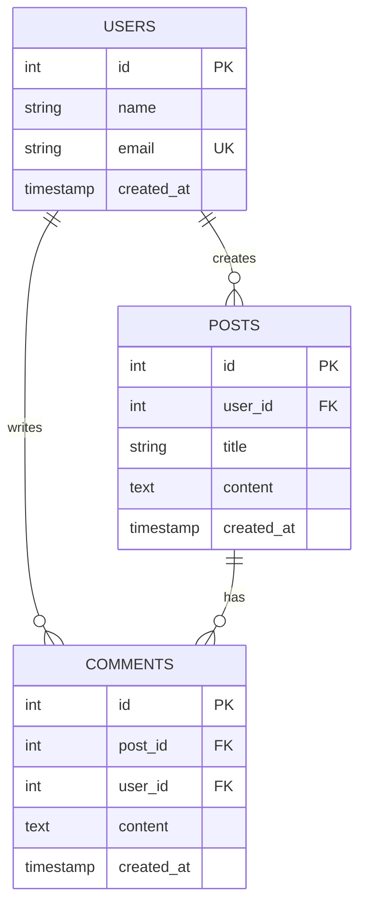
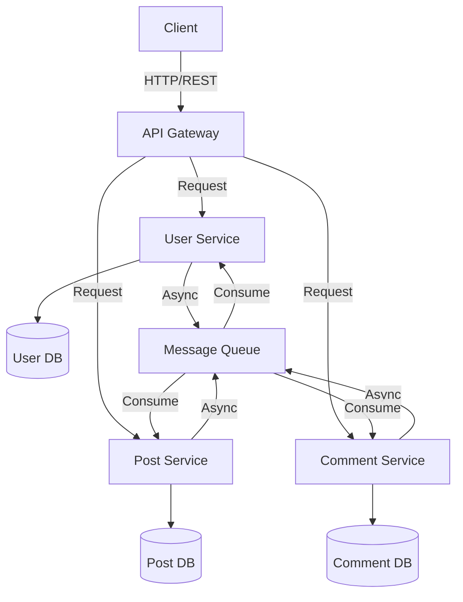

# Claude Codeで図解生成が変わった｜Opus 4.6で図を自動描画する方法

## Claude Codeで図解生成が変わった｜Opus 4.6で図を自動描画する方法

わたし、Claude Codeを使い始めたとき「テキストだけじゃ複雑な構造って説明しにくいな…」って感じていました。でも最近、Opus 4.6の新機能を試してみたら、その課題がかなり解決されたんです。

今日はわたしが実際に試してみて「これ、めっちゃ便利だ」と感じた、Claude Codeで図解を自動生成する方法をシェアしたいと思います。

---

## なぜ図解生成が必要なのか

ソフトウェア開発をしていると、こんなシーンってありませんか？

- 複雑なシステムアーキテクチャを説明したい
- データベーススキーマを視覚化したい
- 処理フローをチーム全体に理解してもらいたい
- APIの呼び出し関係を図で示したい

これまでは、こうした図解を作るために別ツール（Lucidchart、draw.io、Figmaなど）を使う必要がありました。でもそれって結構手間なんです。

Osius 4.6以降、Claude Codeは**プログラムで図を描画できるようになった**んです。つまり、テキスト説明と同時に自動で図が生成できる。これってめっちゃ効率的じゃないですか。

わたしが気づいたのは、特にエンジニアチームとの協働で活躍するってことです。コード変更のたびに手動で図を更新する手間が減るんですよ。

---

## Opus 4.6で図解生成ができる仕組み

Osius 4.6では、Claude Codeが**Mermaid**（メルメイド）というダイアグラム言語をネイティブにサポートするようになりました。

Mermaidは、テキストベースで図を描く言語です。こんな利点があります：

- **バージョン管理が楽**：図もテキストなので、GitHubで差分管理できる
- **プログラムで自動生成できる**：ループで複数の図を作ったり、データベースのスキーマから自動生成できる
- **修正が簡単**：テキストを少し直すだけで図が更新される
- **軽い**：画像ファイルじゃないので、リポジトリが重くならない

Osius 4.6の何がすごいかというと、Claude Codeが**「ユーザーの要望を理解して、自動的にMermaid形式で図を書き出す」**ようになったんです。

---

## 実際の使い方：ステップバイステップ

### 1. Claude Codeを開く

まずClaudeのワークスペースを開いて、Claude Codeを有効にします。Opus 4.6以上を使っていることを確認してください。

（公式ドキュメントでOsius 4.6の確認方法をご確認ください）

### 2. 図解が必要なタスクを説明する

わたしがよくやるのは、こんなプロンプトです：

```
データベーススキーマを図解してください。
テーブル構成：
- users テーブル（id, name, email, created_at）
- posts テーブル（id, user_id, title, content, created_at）
- comments テーブル（id, post_id, user_id, content, created_at）

Mermaid形式で、これらのテーブルの関連図を作成してください。
```

こう書くと、Claude Codeが自動的にMermaid形式のコードを生成します。

### 3. Mermaidコードが生成される

Claudeが生成するコードはこんな感じです：



これをMarkdownのコードブロックに入れると、ほとんどのMarkdownレンダラーで自動的に図として表示されます。

### 4. 複雑なアーキテクチャ図も同じように生成できる

例えば、マイクロサービスのアーキテクチャ図が欲しい場合：

```
以下のマイクロサービスアーキテクチャを図解してください：

API Gateway → User Service, Post Service, Comment Service
User Service → User DB
Post Service → Post DB
Comment Service → Comment DB
すべてのサービスはMessage Queueを使って非同期通信

Mermaid形式で、アーキテクチャ図を作成してください。
```

するとClaudeが自動生成します：



### 5. Codeを実行して、図を確認する

Claudeが生成したMermaidコードをMarkdownファイルに貼り付けると、自動的に図として表示されます。GitHub、Notion、Qiita、noteなど、ほとんどのプラットフォームで対応しています。

---

## Opus 4.6の図解生成で何が嬉しいか

わたしが実感した利点を整理してみます：

**1. プログラムで大量の図が生成できる**

ループで複数のマイクロサービスが対応する場合、データベースのテーブル一覧から自動的に図を生成することもできます。

例えば、こんなプロンプト：

```
以下の5つのマイクロサービスがあります：
- UserService
- ProductService
- OrderService
- PaymentService
- NotificationService

これらが互いに通信する図を自動生成してください。
各サービスは独立したDBを持ちます。
```

**2. コード変更と図が同期される**

テキストベースなので、コード変更時に図も一緒にコミットできます。「図が古い」という問題が減ります。

**3. チームでの共有が楽**

Mermaid形式はテキストなので、Slackやチャットツールにそのまま貼り付けると、自動的に図として表示されるツールが多いです。

---

## よくあるつまずきと解決策

### つまずき1：「Mermaid形式が何かわからない」

わたしも最初は「Mermaidって何…？」という状態でした。でも心配不要です。

Claudeにこう聞けば、詳しく説明してくれます：

```
Mermaid形式で○○という図を作りたいのですが、
Mermaidって何ですか？初心者向けに説明してください。
```

Claudeが基本から教えてくれます。

### つまずき2：「生成された図がMarkdownで表示されない」

原因は複数あります：

- **Markdownレンダラーが古い**：GitHub、Notion、Qiita、noteはほぼ対応していますが、古いブログツールは対応していない可能性があります
- **コードブロックの書き方が間違っている**：```mermaid のあとに改行が必要です
- **Mermaidのシンタックスエラー**：図の構文が間違っていると表示されません。Claudeに「このMermaidコードをチェックしてください」と頼むと修正してくれます

### つまずき3：「複雑な図が思い通りに生成されない」

Mermaidの記法には限界があります。その場合は：

1. Claudeに「シンプルに分割してください」と依頼
2. 複数の小さな図に分けて説明
3. どうしても必要なら、別ツール（draw.io、Lucidchart）で手動作成

---

## 応用アイデア：Codeを活用した自動化

わたしが試してみて面白かったのは、これらの活用法です：

### フローチャートの自動生成

ビジネスプロセスをテキストで説明すると、Claude Codeが自動的にフローチャートを作成します：

```
ユーザー登録フローを図解してください：
1. ユーザーが登録フォームを入力
2. メール認証を送信
3. ユーザーがメール内のリンクをクリック
4. 登録完了
5. エラー時は登録フォームに戻る

Mermaid形式で、フローチャートを作成してください。
```

### API関連図の自動生成

APIのエンドポイント一覧から、呼び出し関係図が生成できます。ドキュメント作成時に役立ちます。

### システムの状態遷移図

ステートマシンの図も自動生成できます。ステータス管理が複雑な場合に重宝します。

---

## 実装ファイルの例

もし図解生成を自動化したい場合、こんなファイル構成も考えられます：

```
project/
├── docs/
│   ├── diagrams/
│   │   ├── database-schema.md
│   │   ├── architecture.md
│   │   └── api-flow.md
│   └── README.md
├── src/
│   └── (ソースコード)
└── generate_diagrams.py
```

`generate_diagrams.py`では、Claudeに定期的に最新のコード構造を読み込ませて、図を自動更新させることもできます。

---

## 注意点：Opus 4.6が必須

この機能を使うには、**Claude Opus 4.6以上**が必要です。古いバージョンだと、図が正しく生成されないか、そもそも対応していない可能性があります。

Claudeのバージョンは、チャットウィンドウで確認できます。

---

## まとめ

Osius 4.6のClaudeで図解生成ができるようになって、わたしが感じたのは「ドキュメント作成がめっちゃ楽になった」ということです。

特にエンジニアにとって、複雑なシステムを図で説明する時間が大幅に短縮されました。

もし図解作成で時間をかけていたなら、一度試してみる価値があります。テキストでClaudeに説明するだけで、自動的に図が生成される。これからのドキュメント作成は、こういうフローになっていくんだと感じています。

わたしもまだ試行錯誤の途中ですが、これからもっと活用方法を探していきたいと思います。

---
※ ハッシュタグ: #Claude #ClaudeCode #Opus4.6 #図解 #Mermaid #エンジニア #ドキュメント作成 #自動化
※ 価格設定: ¥0

---

## X導線ポスト（記事投稿後にURLを差し替えてXに投稿）

```
わたし、最近知ったんですけど…Claude Opus 4.6で図が自動で描けるようになったんですよね。テキストで説明するだけでフローチャートとか図解が勝手に出来ちゃう感じで。これ開発効率めっちゃ変わりそう 🌱

続きはnoteで↓
[noteリンク]
```

※ `[noteリンク]` を実際の記事URLに差し替えてください
